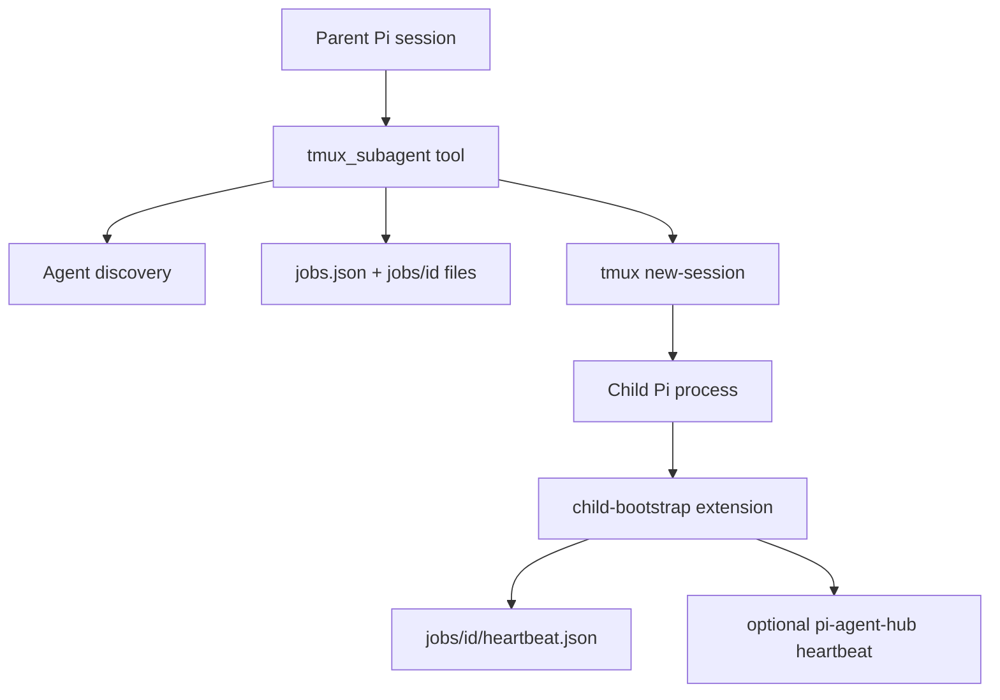

# pi-tmux-subagents Structure

`pi-tmux-subagents` is a minimal Pi extension that launches Markdown-defined subagents as real tmux-backed Pi sessions.

## Architecture



Standalone state is the source of truth under `PI_TMUX_SUBAGENTS_DIR`, or `<PI_CODING_AGENT_DIR>/pi-tmux-subagents` when unset. `pi-agent-hub` mirroring is optional and adapter-based; normal operation must not require hub state.

## Lifecycle

Child Pi sessions auto-stop after clean completion by default so completed subagents do not clutter tmux or `pi-agent-hub` dashboards. Completion is represented as `waiting` after the child has been `running`; foreground runs then stop automatically, and background runs stop when a later `status` call or parent UI poll observes clean completion. Successful auto-stop also removes the mirrored `pi-agent-hub` subagent row. Pass `autoStopOnComplete: false` to keep a child alive for inspection, attach, or follow-up turns, then use `tmux_subagent({ action: "send", childId, message, wait })`, `tmux_subagent({ action: "wait", childId })`, `tmux_subagent({ action: "wait" })` to wait for any active child, and finally `tmux_subagent({ action: "stop", childId })` when done. Failed/interrupted sessions stay alive for inspection. `cancel` remains as a compatibility alias for the same shutdown behavior.

Persistent sessions keep per-turn result files under `jobs/<id>/turns/` and update `jobs/<id>/result.md` to the latest completed result for compatibility. Status output prefers the latest turn result and renders persistent waiting sessions as idle/ready rather than one-shot done. Follow-up messages are bracket-pasted with newlines preserved so multiline prompts submit as one turn. Parent agents should prefer background launches plus useful work and later status checks over blocking waits; `wait` is intended for moments when the parent is genuinely blocked. Each `tmux_subagent` call runs a lightweight hygiene sweep that auto-stops completed auto-stop jobs and keeps idle persistent-child cleanup reminders in structured details instead of prominent user-facing text. Global status without `childId` stays compact by showing active/error jobs plus the 5 most recently stopped jobs; pass `includeStopped: true` to inspect full history. User-facing tool cards omit operational commands, previews, full paths, cleanup notes, and routine model names while showing one identity line, state, elapsed time, last activity for active children, compact real token/cost usage when available, and short result filenames for terminal states.

The parent UI uses one below-editor `setWidget` slot. Default `summary` mode shows compact adaptive cards/rows for active, errored, persistent-idle, and briefly retained clean auto-stop completions. It renders sanitized task previews by default and, when present, fresh optional Agent Hub session metadata from `${PI_AGENT_HUB_DIR}/session-metadata/<child-id>.json` using fields compatible with `pi-session-summary` (`goal`, `status`, `nextStep`, `stage`); `pi-tmux-subagents` only reads those records and does not call a model, scrape panes, or persist raw prompts/outputs to produce summaries. Stale summaries are pruned by a timer even when polling has stopped for an idle persistent child. Clean auto-stopped completions are retained in parent memory for about 10 seconds, then cleared without keeping polling alive. `/subagents`, `alt+s`, and `ctrl+alt+s` toggle between default `summary` and details-table mode; `/subagents show` and `/subagents hide` set details/summary explicitly. `/subagents peek` is an opt-in wider task/status/result view. All modes replace each other in the same widget slot and refresh only when displayed text changes.

Nested launches are opt-in per parent launch with `allowNestedSubagents`, `nestedAgentAllowlist`, and `maxNestedDepth`. The launcher injects `tmux_subagent` into explicit child tool allowlists only when enabled, exports the allowlist/depth policy to the child, and does not propagate nested-launch permission to nested children by default.

Optional `pi-agent-hub` mirror rows use the child ID and tmux session name, render under their parent, and keep the left-column label short (`displayName`/`label` when provided, otherwise `agentName`). `taskPreview` belongs in metadata/details/filtering, not in the row title. Launch labels should be short and prefixed with the agent type, e.g. `worker-auth` or `scout-api`, so parallel children remain distinguishable. Stopping or auto-stopping a subagent cascades to its nested descendants and removes their mirrored hub rows/heartbeats so completed child trees do not linger in the dashboard.

## Layout

- `agents/` — packaged built-in agents (`scout`, `worker`, `delegate`) loaded at lowest priority.
- `src/index.ts` — Pi extension entry point, `tmux_subagent` tool, parent below-editor widget state, and lightweight status polling.
- `src/agents.ts` — Markdown frontmatter discovery for built-in, user, and project agents.
- `src/format.ts` — compact plain-text status cards plus summary/details/peek below-editor widget text for subagent jobs.
- `src/render.ts` — theme-aware TUI rendering for `tmux_subagent` call/result rows.
- `src/names.ts` — canonical package/runtime names.
- `src/paths.ts` — state, job, turn, result, and agent directory path helpers.
- `src/state.ts` — `jobs.json`, per-job metadata, and lock-protected mutation helpers.
- `src/prompt.ts` — child boundary prompt, task contract, Pi CLI argument builder.
- `src/run.ts` — tmux launch/status/cancel/foreground wait behavior.
- `src/session-summary.ts` — best-effort reader for fresh Agent Hub session metadata used by summary and peek widgets.
- `src/tmux.ts` — small tmux command wrapper, including safe paste/send helpers.
- `src/child-bootstrap.ts` — child-side heartbeat extension; writes per-turn result files plus the latest compatibility `result.md` from final assistant messages.
- `src/pi-agent-hub-adapter.ts` — optional dashboard mirroring detection and cleanup.
- `test/` — Node test runner tests compiled through TypeScript.

## Development

```bash
npm install
npm test
```

Use temporary `PI_TMUX_SUBAGENTS_DIR` values for manual smoke tests to avoid touching live jobs.
