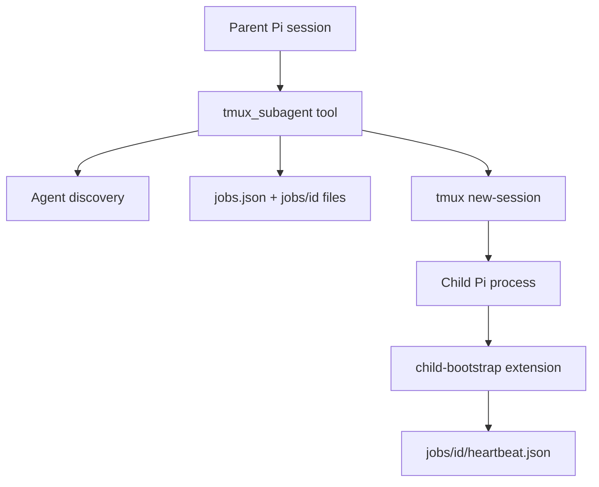

# pi-tmux-subagents Structure

`pi-tmux-subagents` is a minimal Pi extension that launches Markdown-defined subagents as real tmux-backed Pi sessions.

## Architecture



Standalone state is the source of truth under `PI_TMUX_SUBAGENTS_DIR`, or `<PI_CODING_AGENT_DIR>/pi-tmux-subagents` when unset. Optional `pi-sessions` compatibility is adapter-based and must not be required for normal operation. The old default `<PI_CODING_AGENT_DIR>/tmux-subagents` is migrated once and replaced with a symlink when possible so live child processes keep writing to the migrated state.

## Lifecycle

Child Pi sessions auto-stop after clean completion by default so completed subagents do not clutter tmux or `pi-sessions` dashboards. Completion is represented as `waiting` after the child has been `running`; foreground runs then stop automatically, and background runs stop when a later `status` call observes clean completion. Successful auto-stop also removes the mirrored `pi-sessions` subagent row. Pass `autoStopOnComplete: false` to keep a child alive for inspection, attach, or follow-up questions, then use `tmux_subagent({ action: "stop", childId })` when done. Failed/interrupted sessions stay alive for inspection. `cancel` remains as a compatibility alias for the same shutdown behavior.

Optional `pi-sessions` mirror rows use the child ID and tmux session name, render under their parent, and keep the left-column label short (`agentName` only). `taskPreview` belongs in metadata/details/filtering, not in the row title.

## Layout

- `agents/` — packaged built-in agents (`scout`, `worker`, `delegate`) loaded at lowest priority.
- `src/index.ts` — Pi extension entry point and `tmux_subagent` tool.
- `src/agents.ts` — Markdown frontmatter discovery for built-in, user, and project agents.
- `src/format.ts` — compact plain-text parent-session status/progress text for subagent jobs.
- `src/render.ts` — theme-aware TUI rendering for `tmux_subagent` call/result rows.
- `src/names.ts` — canonical package/runtime names and legacy names used by migration.
- `src/paths.ts` — state, job, and agent directory path helpers.
- `src/state.ts` — `jobs.json`, per-job metadata, and lock-protected mutation helpers.
- `src/migration.ts` — one-time default state path and runtime-name migration.
- `src/prompt.ts` — child boundary prompt, task contract, Pi CLI argument builder.
- `src/run.ts` — tmux launch/status/cancel/foreground wait behavior.
- `src/tmux.ts` — small tmux command wrapper.
- `src/child-bootstrap.ts` — child-side heartbeat extension; also writes a fallback `result.md` from the final assistant message when the child did not create one explicitly.
- `src/pi-sessions-adapter.ts` — optional dashboard compatibility detection/mirroring.
- `test/` — Node test runner tests compiled through TypeScript.

## Development

```bash
npm install
npm test
```

Use temporary `PI_TMUX_SUBAGENTS_DIR` values for manual smoke tests to avoid touching live jobs.
